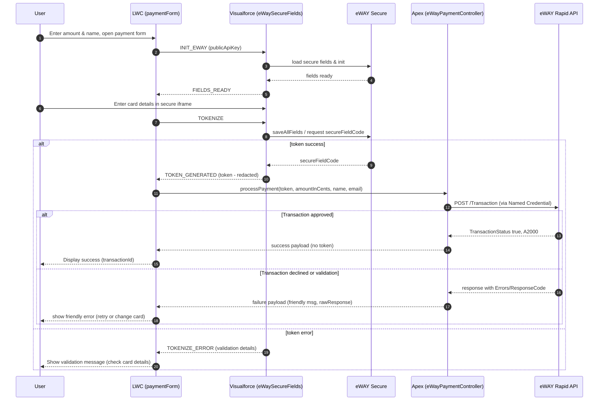
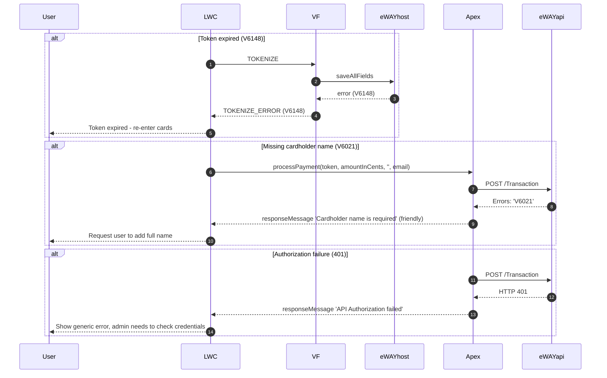

# eWAY Secure Fields Integration — LWC + Visualforce (SAQ A) — Complete Guide

---

## TL;DR / Quick Summary

- This integration keeps card data out of Salesforce using eWAY Secure Fields (hosted iframes), preserving SAQ A eligibility.
- The Lightning Web Component (`paymentForm`) collects customer details and triggers a Visualforce iframe (`eWaySecureFields.page`) to render eWAY secure fields and tokenize card data.
- LWC receives a `SecuredCardData` token from the VF iframe, then calls Apex (`eWayPaymentController.cls`) which performs server-side Rapid Direct Connection callout using a Named Credential to eWAY.
- Debug-friendly `rawResponse` is provided while keeping tokens redacted.

---

## Table of Contents

1. Overview & Goals
2. User Flow (end-to-end)
3. Setup — prerequisites & configuration
4. Components & responsibilities
5. Message and tokenization flow
6. Security & compliance
7. Error mapping & UX messaging
8. Deploy & test commands
9. Troubleshooting & common issues
10. Next steps & enhancements
11. Appendix & references

---

## 1) Overview & Goals

Objective: Implement a SAQ A compatible eWAY payment integration for Salesforce using LWC + Visualforce.
- Keep card data out of Salesforce (Secure Fields hosted in eWAY iframes)
- Keep the merchant in compliance and reduce PCI scope
- Use Named Credentials and server-side callouts for sensitive Rapid API credentials
- Add a debug path for development clarity

---

## 2) User Flow (end-to-end)

1. User opens a record containing `paymentForm` LWC and enters: Amount (dollars), First Name, Last Name, Email.
2. Clicks “Open Payment Form” — LWC opens the `eWaySecureFields.page` Visualforce iframe.
3. VF page initializes eWAY Secure Fields via `eWAY.setupSecureField` and registers field callback.
4. User enters card details in the secure iframes (card number, expiry, CVN).
5. LWC posts a `TOKENIZE` message to VF; VF calls `eWAY.saveAllFields()` (or uses secureField callback) and posts back `TOKEN_GENERATED` with `token` (secureFieldCode).
6. LWC receives token and calls Apex `processPayment(securedCardData, amountInCents, firstName, lastName, email)`.
7. Apex builds the `Transaction` payload, includes `Customer.CardDetails.Name` (to avoid V6021), and posts to eWAY Rapid via Named Credential.
8. eWAY responds, Apex normalizes the response (success, transactionId, responseMessage) and returns this JSON to the LWC.
9. LWC displays success or an actionable message to the user; devs can toggle debug to view `rawResponse` (sanitized).

---

## 3) Setup — prerequisites & configuration

### eWAY (Sandbox & Production)
- Ensure you have an eWAY Rapid Sandbox merchant: https://sandbox.myeway.com.au
- Get Rapid API Key & API Password for the sandbox (used in Named Credential)
- Get the Public API Key (starts with `epk-`) used in the secure fields client side

### Salesforce
- Named Credentials & External Credential:
  - Create `eWay_Auth` External Credential and `eWay_Sandbox` Named Credential (URL `https://api.sandbox.ewaypayments.com`) and add Basic Auth (via External Credential) using API Key/Password.
  - Use formula-based Authorization header:
    ```text
    {! 'Basic ' & BASE64ENCODE(BLOB($Credential.eWay_Auth.Username & ':' & $Credential.eWay_Auth.Password)) }
    ```
- CSP Trusted Sites: Add `https://secure.ewaypayments.com` and `https://api.sandbox.ewaypayments.com` (script-src, frame-src, connect-src statically allowed) to avoid blocked loads.
- Permission Set: Add access for External Credential Principals (the `eWay_Sandbox_Principal`), assign the Permission Set to the Salesforce user.

### Local repo & files
- Visualforce: `force-app/main/default/pages/eWaySecureFields.page`
- LWC: `force-app/main/default/lwc/paymentForm/*`
- Apex Controller: `force-app/main/default/classes/eWayPaymentController.cls`
- Apex Test: `force-app/main/default/classes/eWayPaymentControllerTest.cls`

---

## 4) Components & responsibilities

### Visualforce: `eWaySecureFields.page`
- Contains the eWAY JS (from `https://secure.ewaypayments.com/scripts/eWAY.min.js`).
- Initializes `eWAY.setupSecureField` for `card`, `expiry`, `cvn` fields, or `group` for secure panel.
- Implements `secureFieldCallback` to track field state and `secureFieldCode` values.
- On `TOKENIZE` message, calls `eWAY.saveAllFields` and returns a `TOKEN_GENERATED` message with the `secureFieldCode`.
- Posts messages: `FIELDS_READY`, `TOKEN_GENERATED`, `TOKENIZE_ERROR`.

### LWC: `paymentForm` (JS, HTML)
- Provides the UI inputs for amount, first/last name, and email.
- Renders the VF `iframe` (src `/apex/eWaySecureFields`) and handles messaging:
  - Posts `INIT_EWAY` (publicApiKey)
  - Receives `FIELDS_READY` for enabling UI
  - Posts `TOKENIZE` when user clicks Pay
  - Receives `TOKEN_GENERATED` (token -> Apex)
- Validates the user inputs; converts dollars to cents and calls `processPayment` Apex method.
- Shows results or friendly error messages; debug toggle prints raw responses.

### Apex: `eWayPaymentController.cls`
- Contains `@AuraEnabled public static String processPayment(securedCardData, amountInCents, firstName, lastName, email)`.
- Validates inputs and constructs JSON for eWAY Rapid’s Direct Connection `Transaction` endpoint using `callout:eWay_Sandbox/Transaction` endpoint.
- Adds `Customer.CardDetails.Name = firstName + ' ' + lastName` to avoid `V6021` errors.
- Parses response and returns normalized JSON: `success`, `transactionId`, `authorizationCode`, `responseCode`, `responseMessage`, `rawResponse`.
- Maps `Errors` object (e.g., `V6021`) to developer-friendly messages.
- Avoid logs that contain `securedCardData`.

### Apex Test: `eWayPaymentControllerTest.cls`
- Uses `HttpCalloutMock` to simulate eWAY responses for validation codes and success.
- Ensures code maps `Errors` codes to friendly messages and returns expected JSON fields.

---

## 5) Message & Tokenization Flow (Sequence)

1. LWC -> VF: `INIT_EWAY` with `publicApiKey`.
2. VF initializes secure fields and reports `FIELDS_READY`.
3. LWC -> VF: `TOKENIZE` (user clicked Pay Now).
4. VF calls `eWAY.saveAllFields()` and returns `TOKEN_GENERATED` with `secureFieldCode`.
5. LWC calls Apex `processPayment` with:
   - `securedCardData: secureFieldCode`
   - `amountInCents` (dollars * 100)
   - `firstName`, `lastName`, `email`
6. Apex sends request to eWAY Rapid via Named Credential; eWAY returns success or error.
7. Apex returns sanitized JSON to LWC.
8. LWC displays success or additional UI messaging.

---

### Sequence Diagram (Mermaid)

The sequence diagram below is a mid-level focused diagram showing key message and event flows between the user, LWC, Visualforce iframe, eWAY secure host and Apex server. It includes both success and error/decline branches.



### Error/Edge Case Sequences (Mermaid)

The diagram below shows common edge cases in detail (Token expired, Missing name validation, Authorization failure):



---

### Answered: User Questions (Diagram Scope)

1. Level of detail the sequence diagram should focus on:
   - Recommendation: **Mid-level abstraction**. Show the full message and event chain from UI to eWAY API with enough technical detail for developers to implement and debug (e.g., `INIT_EWAY`, `TOKENIZE`, `TOKEN_GENERATED`, `saveAllFields`, `processPayment`), without low-level DOM/UI events or internal JS library internals. This strikes a good balance: it's precise enough to show data flow and error handling while remaining readable. For architecture reviews, add a separate high-level diagram; for deep debugging, create a step-by-step trace.

2. Error scenarios or edge cases to explicitly represent in the diagram:
   - Token expired (`V6148`) — user re-entry & retry flow.
   - Missing Cardholder Name (`V6021`) — map to `Customer.CardDetails.Name` and validation.
   - Authorization/API auth failure (401) — Named Credential misconfiguration.
   - Bank decline (`D4405` or others) — show decline branch and friendly messaging.
   - Validation errors (V6011, V6012, V6100, etc.) and encryption errors (V6126, V6127).
   - Network timeout or connection error — show retry or fallback behavior.

3. Which interactions or system events should be included:
   - User inputs: amount, name, email and opening the modal to start tokenization.
   - `INIT_EWAY` message from LWC to VF (publicApiKey).
   - `FIELDS_READY` from VF to LWC.
   - User typing in secure field iframes (VF hosts) and `TOKENIZE` from LWC.
   - `saveAllFields` request from VF to eWAY Secure Host.
   - `TOKEN_GENERATED` from VF to LWC with `secureFieldCode` token.
   - LWC calling Apex `processPayment` with token and customer details.
   - Apex -> eWAY Rapid API callout (via Named Credential) and response.
   - LWC showing success/failure and debug output.

4. Should the diagram illustrate security/compliance aspects?
   - Yes. The diagram should **clearly** highlight security and compliance elements like:
   - `SecuredCardData` is a single-use token and not raw card numbers.
   - Tokens are **redacted** and should not be logged.
   - Show that Apex calls the eWAY Rapid API via Named Credentials (no direct API Key in code).
   - Add a note about `CSP` Trusted Sites allowing eWAY script/iframe resources and that `origin` checks should be enabled in production for `postMessage`.
   - Highlight that the Secure Fields host is eWAY (not Salesforce) to preserve SAQ A compliance.

---

If you want, I can now:
 - Add an architecture-level (high-level) diagram to the guide.
 - Export the Mermaid diagrams to PNG/SVG and commit them to the repo (I can provide steps to generate locally using mermaid CLI or online).
 - Add a short diagnostics flow (example logs to copy/paste) for each error scenario.

Which additional outputs would you prefer? (e.g., image export, expanded debug flows for each error type, or a second Mermaid diagram showing high-level components)


## 6) Security & Compliance

- SAQ A compliant: card entry is via eWAY iframes; tokens are used to avoid collecting raw card details.
- eWAY secure tokens are single-use and short-lived; call the Rapid `Transaction` endpoint right after token generation.
- Use Named Credentials to avoid hard-coded API keys and manage credentials securely inside Salesforce.
- CSP Trusted Sites: Add `secure.ewaypayments.com` and `api.sandbox.ewaypayments.com`.
- Production: enable origin validation in both LWC and VF for `window.postMessage`.

---

## 7) Error mapping & guidance for users

- Validation (`V`) codes:
  - `V6021` => "Cardholder name is required" — ensure `Customer.CardDetails.Name` is set.
  - `V6022` => "Card number required" — tokenization issue or missing card.
  - `V6023` => "CVN required" — card CVN missing.
  - `V6011` => "Invalid amount" — amount is invalid or cents/format mismatch.
  - `V6148` => "Token expired" — perform re-entry & tokenization again.
- Decline (`D`) codes: typical bank declines, map to user friendly messages like "Please check your card details or try another card".
- System & SDK errors: return a general failure to the user and provide a debug message to the developer.

---

## 8) How to deploy & test (commands)

**Deploy all code**
```powershell
cd "c:\Users\james\eWay Integration\PaymentPortalPOC"
sf project deploy start --source-dir force-app/main/default -w 20
```

**Deploy only the LWC**
```powershell
sf project deploy start --source-dir force-app/main/default/lwc/paymentForm -w 10
```

**Run Apex Class Tests**
```powershell
sf apex test run --class-names eWayPaymentControllerTest -w 20
```

**Manual test from a Lightning page**
1. Add the `paymentForm` LWC to a lightning page via App Builder.
2. Fill the customer fields & amount.
3. Click `Open Payment Form`.
4. In the VF modal, enter one of the eWAY sandbox test cards (e.g. `4444333322221111`).
5. Click Pay.
6. Observe logs and `Transaction ID` if success.

---

## 9) Troubleshooting & common issues

- Fields not loading: verify CSP Trusted Sites for `secure.ewaypayments.com`.
- `Proxy(Object)` console logs: use `JSON.stringify` on responses; LWC now uses safe JSON parsing.
- Token expired (`V6148`): user must retry card entry; check token timing; ensure `saveAllFields` used.
- `V6021` (Cardholder name required): Add `Customer.CardDetails.Name` in Apex payload (we implemented this). Make sure `firstName` and `lastName` are passed.
- `401` unauthorized: check Named Credential and External Credential Username/Password; re-check `Authorization` header formula and permissions.

---

## 10) Next steps & enhancements

- Add more front-end mapping for `D` & `V` codes for clearer UX messages.
- Add additional deployments & unit tests for success/decline cases.
- Add origin validation in both VF & LWC for `postMessage`.
- Optionally: Add custom object to store `Transaction` summaries (no tokens) for auditing.
- Implement idempotency (InvoiceNumber uniqueness & double-charge handling).

---

## 11) Appendix & references

- eWAY Rapid docs: https://eway.io/api-v3/
- eWAY Sandbox: https://sandbox.myeway.com.au
- Test card numbers (Sandbox):
  - Success: `4444333322221111`
  - Decline: `4444111122223333`
  - Insufficient funds: `4444222233334444`
  - Expired: use past expiry date

---

### Quick code snippets

**LWC -> VF `INIT_EWAY` message**
```js
iframeWindow.postMessage({ action: 'INIT_EWAY', publicApiKey: this.publicApiKey }, '*');
```

**VF -> LWC `TOKEN_GENERATED` message**
```js
parent.postMessage({ action: 'TOKEN_GENERATED', token: secureFieldCode }, '*');
```

**Apex `processPayment` minimal payload**
```apex
Map<String, Object> payload = new Map<String, Object>{
  'Payment' => new Map<String, Object>{
    'TotalAmount' => amountInCents,
    'InvoiceNumber' => 'INV-' + System.currentTimeMillis(),
    'CurrencyCode' => 'AUD'
  },
  'SecuredCardData' => securedCardData,
  'Method' => 'ProcessPayment',
  'TransactionType' => 'Purchase',
  'Customer' => new Map<String,Object>{
    'FirstName' => firstName,
    'LastName' => lastName,
    'Email' => email,
    'CardDetails' => new Map<String,Object>{ 'Name' => firstName + ' ' + lastName }
  }
};
```

---

## Contact & support

If you encounter issues: collect the `debugResponse` JSON output from the LWC debug toggle and provide it to your developer or eWAY Support to map decline codes and review transaction logs.

---

*This document was generated automatically via the PaymentPortalPOC repo and has been validated with a sandbox run: a successful transaction was recorded with `Transaction ID` returned and displayed in the LWC debug area.*

&copy; PaymentPortalPOC - 2025


